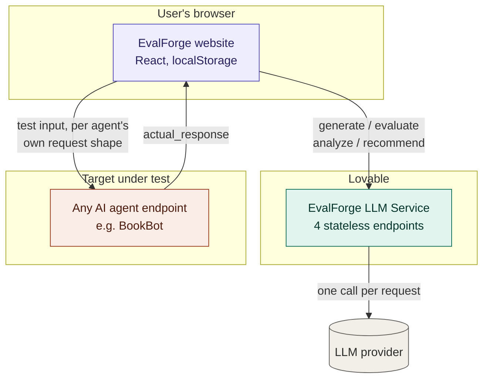
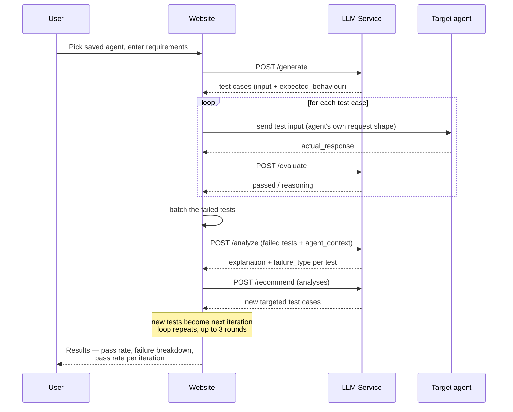

# EvalForge

**An AI agent that tests other AI agents.**

EvalForge is a closed-loop functional testing system for AI/API-driven applications. It generates functional test cases from plain-language requirements, executes them against a target agent, evaluates the results, explains *why* things failed, and then automatically generates smarter follow-up tests targeting the weak spots it just found — repeating until coverage and quality are satisfactory.

Built for the [Sebaka South Africa AI Agent Challenge](https://sebakasouthafrica.co.za/ai-agent-challenge.html), under the **Functional Testing** problem statement: *generate, analyse, prioritise, and execute functional testing activities.*

---

## Why this exists

Testing AI systems today is mostly manual: someone dreams up test cases, runs them by hand, reads the transcripts, and figures out what broke. That doesn't scale, and it misses the failure modes that matter most for AI systems specifically — inconsistency, hallucination, overconfidence, and silent misrouting of intent.

EvalForge automates the whole loop, and critically, doesn't stop at one static pass. It uses what it learns from failures to write better tests next round, so the more it runs against a target, the sharper it gets at finding real problems.

---

## The core loop

```
Requirements → Generate tests → Run tests → Evaluate pass/fail
      ↑                                                  │
      │                                                  ▼
Generate targeted follow-ups ← Analyse failures ←────────┘
```

Without this loop, EvalForge is "a website that calls an LLM." With it, EvalForge behaves like an actual testing agent — one that gets more effective the longer it's pointed at a system, instead of running the same fixed checklist every time.

---

## System architecture

Two separate deployed pieces, talking to each other and to whatever agent is under test:



**Key separation:** the website owns orchestration and storage; the LLM service owns reasoning; the target agent is untouched and doesn't know it's being tested. The website talks to both, but the LLM service and the target agent never talk to each other directly.

---

## The full test loop, step by step



The loop repeats automatically for up to 3 iterations, then pauses with a manual "run another iteration" control.

---

## Components

### 1. EvalForge website (this repo)
React app, no backend of its own. All state lives in the browser via `localStorage`.

| Screen | Purpose |
|---|---|
| **Agents** | Save reusable target profiles: endpoint URL, method, headers, request body template (with a `{{input}}` placeholder), response path, and — optionally — the target's own system prompt/description |
| **Setup** | Pick a saved agent, write requirements + optional constraints, kick off a run |
| **Run** | Live stepper (Generate → Run → Evaluate → Analyse → Adapt) with a real-time test feed |
| **Results** | Pass rate, failure breakdown by category, per-test detail, pass rate per iteration, JSON export |

Storage: `evalforge_agents` (array of agent profiles) and one `evalforge_run_<timestamp>` key per run.

### 2. EvalForge LLM Service (separate project, Lovable)
Stateless JSON API. Base URL: `https://evalforge-test-buddy.lovable.app/api/public`

| Endpoint | Purpose |
|---|---|
| `POST /generate` | Turn plain-language requirements into a batch of test cases |
| `POST /evaluate` | Judge one test result as pass/fail against its expected behaviour |
| `POST /analyze` | Explain and classify why a batch of already-failed tests failed |
| `POST /recommend` | Generate new, targeted follow-up tests from failure analyses |

Every endpoint accepts an optional `agent_context` (`system_prompt`, `description`) so reasoning is grounded in what the target agent was actually told to do, not judged in a vacuum. One LLM call per request, strict JSON in/out, CORS open, no auth yet (an `x-api-key` header can be added later without a rewrite).

### 3. Target agent (whatever you're testing)
Not part of this repo. Any AI endpoint — a support bot, an internal assistant, a demo project. The website talks to it using the connection details saved on its Agent profile, so the same EvalForge instance can test any agent without code changes.

---

## Data model

**Agent profile:**
```json
{
  "id": "agent_abc123",
  "name": "BookBot demo",
  "url": "string",
  "method": "POST",
  "headers": { "Authorization": "Bearer ..." },
  "body_template": "{ \"messages\": [ { \"role\": \"user\", \"content\": \"{{input}}\" } ] }",
  "response_path": "choices.0.message.content",
  "system_prompt": "string, optional",
  "description": "string, optional"
}
```

**Run record:**
```json
{
  "id": "run_1234",
  "agent_id": "agent_abc123",
  "agent_snapshot": { "...": "copy of the agent profile at run time" },
  "requirements": "string",
  "constraints": "string, optional",
  "iterations": [
    {
      "iteration_number": 1,
      "tests": [
        {
          "id": "t1",
          "input": "string",
          "expected_behaviour": "string",
          "category": "happy_path",
          "actual_response": "string",
          "latency_ms": 812,
          "passed": true,
          "eval_reasoning": "string",
          "failure_analysis": null,
          "spawned_from": null
        }
      ],
      "pass_rate": 0.85
    }
  ]
}
```

---

## Getting started

```bash
git clone <repo-url>
cd evalforge-website
npm install
npm run dev
```

On first load, go to **Agents** and save at least one target agent before starting a run.

The LLM service is already deployed and doesn't need to be run locally — the website points at:
```
https://evalforge-test-buddy.lovable.app/api/public
```

---

## Testing the LLM service directly

Each endpoint can be exercised with `curl` independently of the website — useful for confirming the reasoning layer works before or without the UI:

```bash
curl -X POST https://evalforge-test-buddy.lovable.app/api/public/generate \
  -H "Content-Type: application/json" \
  -d '{
    "requirements": "A support agent for an online bookstore...",
    "agent_context": { "system_prompt": "You are BookBot..." },
    "num_tests": 5
  }'
```

See `evalforge-usage-guide.md` for full curl examples across all four endpoints plus a website walkthrough.

---

## Project status

Hackathon MVP — built to demonstrate the adaptive test → evaluate → analyse → retest loop end-to-end against a live demo target. Not production-hardened. No auth on the LLM service yet; not intended for public deployment as-is.

## Team

*(add names/roles)*

## License

*(add license)*